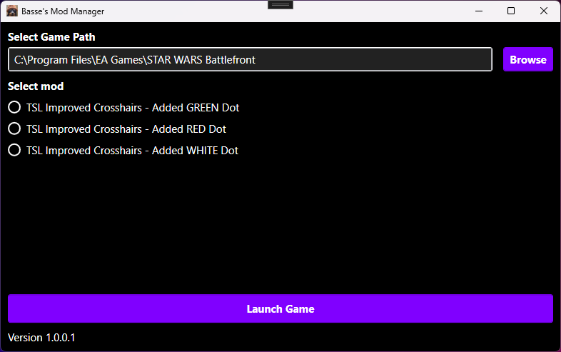
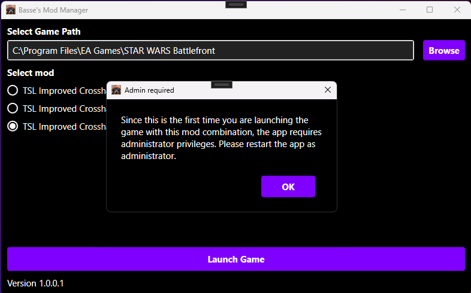
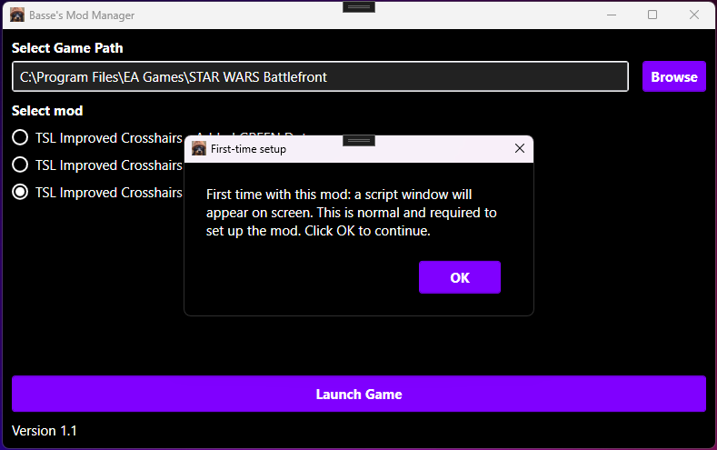

# Release 2 – v1.1

## Summary

- Version numbering simplified to 1.1 (from 1.0.0.1).
- .NET Framework 4.8 is now bundled in the installer (Prereqs). If the user does not have .NET 4.8 installed, the installer runs it automatically during setup (passive install).

### UX and messaging

- **Frosty Toolsuite message boxes disabled.** The Frosty message boxes that appeared during mod setup (e.g. about symbolic links) were confusing for users. They are now suppressed when running from Basse's Mod Manager, so only the app’s own dialogs are shown.
- **Clearer in-app messages.** Text that used to sit in the main window was replaced with dedicated message boxes for errors and explanations. This makes it easier to understand what’s going on and what to do.
- **Update-notification dialog resized.** The dialog that appears when an update is available used to show everything on one long line, making the window very wide and short. It now has a fixed, readable size with proper line breaks.

## Screenshots

